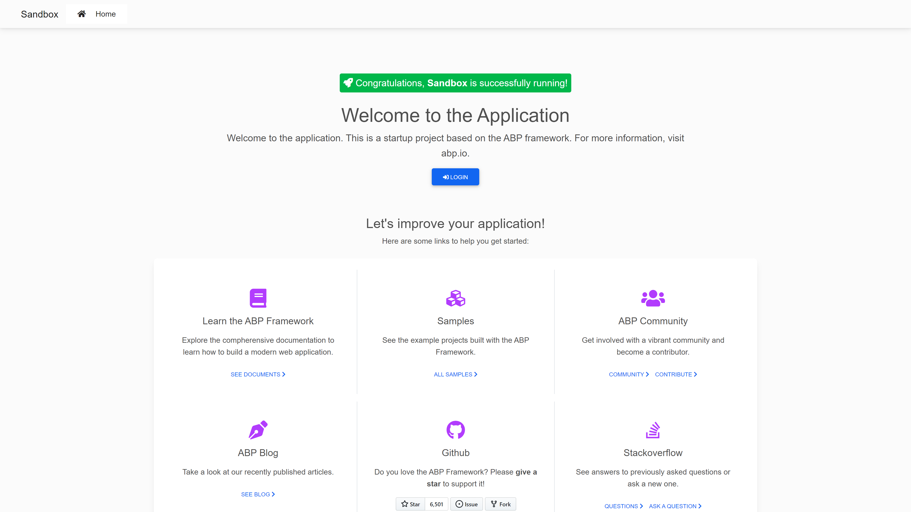
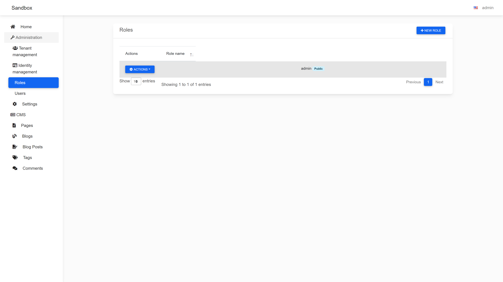
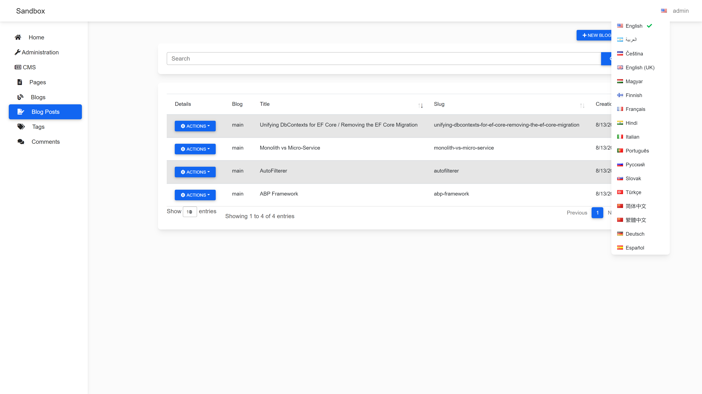
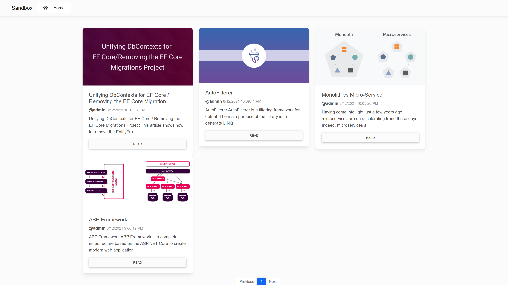

# Enisn.Abp.AspNetCore.Mvc.UI.Theme.Material
[Material Design](https://mdbootstrap.com/) theme for [ABP Framework](/abpframework/abp).

## Showcase

You can visit the [Live Demo](https://abp-material.herokuapp.com/).










## Installation
- Install [Nuget Package](https://www.nuget.org/packages/Enisn.Abp.AspNetCore.Mvc.UI.Theme.Material) to your **Web** project.

```bash
dotnet add package Enisn.Abp.AspNetCore.Mvc.UI.Theme.Material
```

- Replace Basic Theme with Material Theme.

```diff

[DependsOn(
        typeof(SandboxHttpApiModule),
        typeof(SandboxApplicationModule),
        typeof(SandboxMongoDbModule),
        typeof(AbpAutofacModule),
        typeof(AbpIdentityWebModule),
        typeof(AbpSettingManagementWebModule),
        typeof(AbpAccountWebIdentityServerModule),
-       typeof(AbpAspNetCoreMvcUiBasicThemeModule),
+       typeof(AbpAspNetCoreMvcUiMaterialThemeModule),
        typeof(AbpAspNetCoreAuthenticationJwtBearerModule),
        typeof(AbpTenantManagementWebModule),
        typeof(AbpAspNetCoreSerilogModule),
        typeof(AbpSwashbuckleModule)
        )]
    public class SandboxWebModule : AbpModule
    {
        // ...
```


## Configuration

### Using Public Layout

- You can force to use Public layout for entire application via adding `Pages/_ViewStart.cshtml`

- If you want to use Public layout **only** CmsKit pages, you must place it to `Pages/Public/_ViewStart.cshtml`


```razor
@using Volo.Abp.AspNetCore.Mvc.UI.Theming
@inject IThemeManager ThemeManager
@{
    Layout = ThemeManager.CurrentTheme.GetPublicLayout();
}
```


## Credits

- [MDB - Material Design for Bootstrap 5 & 4 (mdbootstrap.com)](https://mdbootstrap.com/)
